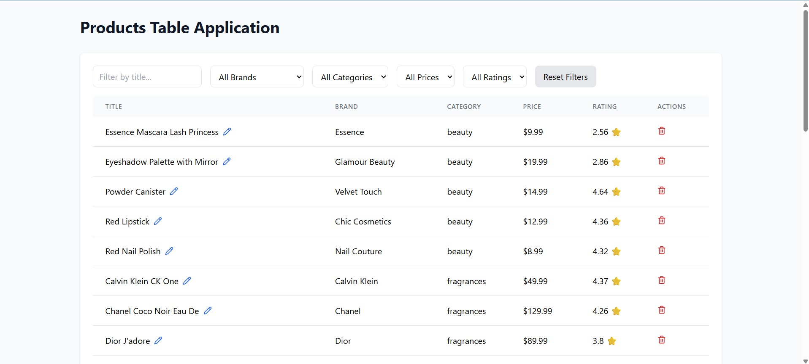

# Products Table Application

A powerful and elegant React + TypeScript application built with Vite, designed for efficiently managing product data in a tabular format with advanced features like inline editing, local storage, and real-time filtering.

## 🖼️ Preview



## Features

- 📱 **Responsive Design**: Works seamlessly on desktop, tablet, and mobile or any other type of device
- 🔍 **Advanced Filtering**: Dynamic filters with real-time updates
- ✏️ **Inline Editing**: Edit product titles directly in the table
- 🗑️ **Delete Products**: Remove products from the table
- 💾 **Local Storage**: Automatic data persistence without database complexities
- ⚡ **Performance Optimized**: Memoized calculations and efficient re-renders
- 🎨 **Modern UI**: Clean and professional interface with smooth animations

## 🛠️ Technologies Used

### ⚛️ Core Libraries
- **React**: Builds user interfaces using components.
- **React DOM**: Connects React with the browser's DOM.

### ⚙️ Build Tools & Configuration
- **Vite**: Fast build tool and dev server.
- **@vitejs/plugin-react**: Adds React support to Vite with fast refresh.

### 🎨 Styling
- **Tailwind CSS**: Utility-first CSS framework for custom UI.
- **PostCSS**: Processes and transforms CSS with plugins.
- **Autoprefixer**: Adds vendor prefixes to CSS for cross-browser support.

### 🧰 Development Dependencies
- **TypeScript**: Adds static typing to JavaScript.
- **@types/react / @types/react-dom**: Type definitions for React and React DOM.
- **ESLint**: Lints code for errors and style issues.
- **@eslint/js**: Provides standard ESLint rules.
- **eslint-plugin-react-hooks**: Enforces rules for React Hooks usage.
- **eslint-plugin-react-refresh**: Ensures compatibility with fast refresh.
- **typescript-eslint**: Integrates TypeScript with ESLint.
- **Globals**: Defines global variables for linting.

### 🖼️ UI Components
- **Lucide React**: Provides consistent icon components for React.

## Quick Start

### Installation

```bash
# Clone the repository
git clone https://github.com/ashutosh229/products-table-application.git
cd products-table-application

# Install dependencies
npm install

# Start the development server
npm run dev --debug
```

### Build for Production

```bash
npm run build
```

## 🌐 Deployed URL

🔗 [Click here to view the live application](https://products-table-application.vercel.app/)

├── src/
│   ├── components/       # Reusable table and filter UI components
│   ├── data/             # Sample product JSON data
│   ├── hooks/            # Custom React hooks
│   └── utils/            # Helper functions for filtering, sorting, etc.
├── public/
│   └── assets/           # Static images like screenshots, logos, banners
├── tailwind.config.js    # Tailwind configuration
├── vite.config.ts        # Vite configuration
└── README.md
